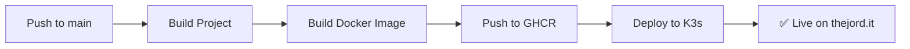

<div align="center">


# 🛠️ **THEJORD.IT**

### **The Italian Alternative to IT-Tools | Privacy-First Developer Utilities**

[](https://github.com/thejord-it/thejord-tools/stargazers)
[](https://opensource.org/licenses/MIT)
[](https://reactjs.org/)
[](https://www.typescriptlang.org/)
[](https://vitejs.dev/)
[](https://tailwindcss.com/)
[](https://thejord.it)
[](https://github.com/thejord-it/thejord-tools/pulls)

<p align="center">
  <a href="https://thejord.it"><strong>🌐 Live Demo</strong></a> •
  <a href="./docs/"><strong>📖 Documentation</strong></a> •
  <a href="https://github.com/thejord-it/thejord-tools/issues"><strong>🐛 Report Bug</strong></a> •
  <a href="https://github.com/thejord-it/thejord-tools/issues"><strong>✨ Request Feature</strong></a>
</p>

**Modern, fast, and free tools for developers.**
**A comprehensive suite of online utilities built with React, TypeScript, and Tailwind CSS.**

<kbd>[🇮🇹 Italian](#italiano)</kbd> | <kbd>[🇬🇧 English](#english)</kbd>

---

</div>

> **🇮🇹 Italian-First Developer Tools**: Built for the Italian developer community with enterprise-grade documentation and modern tech stack.

<div align="center">

## 🎉 **What's New in v1.1.0** (January 2025)

🔐 **Base64 File Operations** - Upload/download files with 50+ type detection
🎨 **Toast Notifications** - Modern UI feedback replacing browser alerts
📄 **JSON Single Quotes** - Convert JSON double quotes to single quotes
🎯 **Reusable Layout** - Consistent navigation across all tools
📖 **User Guide** - Complete documentation for all tools

[View Full Changelog →](./CHANGELOG.md)

---

### 🚀 **Quick Links**

| 📄 [JSON Formatter](https://thejord.it/json-formatter) | 🔐 [Base64 Tool](https://thejord.it/base64) | 🔍 [RegEx Tester](https://thejord.it/regex-tester) |
|:--:|:--:|:--:|
| **[Hash Generator](https://thejord.it/hash-generator)** | **[URL Tool](https://thejord.it/url-tool)** | **[Color Picker](https://thejord.it/color)** |

</div>

---

## 💎 Why Choose THEJORD.IT?

<div align="center">

| 🏆 Feature | THEJORD.IT | Other Tools |
|:-----------|:----------:|:-----------:|
| **Italian-First** | ✅ IT Community | ❌ English Only |
| **Open Source** | ✅ MIT License | ⚠️ GPLv3/Proprietary |
| **CI/CD Pipeline** | ✅ Automated Deploy | ⚠️ Manual/Varies |
| **Documentation** | ✅ Enterprise-Grade | ⚠️ Basic/None |
| **Modern Stack** | ✅ React 18 + Vite | ⚠️ Vue/Angular/jQuery |
| **Client-Side** | ✅ 100% Browser | ✅ Most Tools |
| **File Support** | ✅ 50+ File Types | ⚠️ Limited |
| **Self-Hosting** | ✅ Docker + K3s | ⚠️ Docker Only |

</div>

---

## ✨ Features

<table>
  <tr>
    <td align="center">🇮🇹</td>
    <td><b>Made in Italy</b><br/>The Italian alternative to IT-Tools with focus on IT community.</td>
  </tr>
  <tr>
    <td align="center">⚡</td>
    <td><b>Lightning Fast</b><br/>Built with React 18, Vite, and optimized for performance. Bundle size: 131KB gzipped.</td>
  </tr>
  <tr>
    <td align="center">🎨</td>
    <td><b>Beautiful UI</b><br/>Clean, modern dark theme with intuitive design. Fully responsive.</td>
  </tr>
  <tr>
    <td align="center">🌍</td>
    <td><b>100% Client-Side</b><br/>Works offline after first load. All tool processing in browser.</td>
  </tr>
  <tr>
    <td align="center">📊</td>
    <td><b>Privacy-Conscious Analytics</b><br/>Google Analytics with IP anonymization. Transparent data usage. <a href="/privacy">Privacy Policy →</a></td>
  </tr>
  <tr>
    <td align="center">🔧</td>
    <td><b>9 Essential Tools</b><br/>Carefully curated developer utilities. <a href="#%EF%B8%8F-available-tools">See all →</a></td>
  </tr>
</table>

---

## 🛠️ Available Tools

| Tool | Description | Key Features |
|------|-------------|--------------|
| **📝 JSON Formatter** | Format, validate, and convert JSON | Beautify, minify, tree view, JSON↔CSV, JSON↔YAML, single quotes support |
| **🔤 Base64 Encoder/Decoder** | Encode and decode Base64 strings | File upload/download (5MB max), 50+ file type detection (images, PDF, ZIP, etc.) |
| **🔍 RegEx Tester** | Test regular expressions live | 30+ predefined patterns, match highlighting |
| **🔐 Hash Generator** | Generate cryptographic hashes | MD5, SHA-1, SHA-256, SHA-512, SHA-3, toast notifications |
| **🔗 URL Encoder/Decoder** | Encode and decode URLs | Component and full URL support |
| **📄 Markdown to HTML** | Convert Markdown to sanitized HTML | Live preview, DOMPurify sanitization |
| **🎨 Color Converter** | Convert between color formats | HEX, RGB, HSL, CMYK with visual picker |
| **📰 Lorem Ipsum Generator** | Generate placeholder text | Words, sentences, paragraphs with stats |
| **📊 Text Diff Checker** | Compare text line by line | Ignore whitespace, case-sensitive options |

---

## 🚀 Quick Start

<div align="center">

### 🎯 **Three Ways to Use THEJORD.IT**

| 🌐 **Online** | 💻 **Local Dev** | 🐳 **Docker** |
|:--------------:|:----------------:|:-------------:|
| [**Visit thejord.it**](https://thejord.it)<br/>No installation needed | Clone & run locally<br/>Full dev environment | Pull & run container<br/>Production-ready |
| ✅ **Instant** | ⚡ **Fast** | 🔒 **Secure** |

</div>

---

### 💻 Local Development

**Prerequisites:** Node.js 18+ • npm 9+

```bash
# 1️⃣ Clone the repository
git clone https://github.com/thejord-it/thejord-tools.git
cd thejord-tools

# 2️⃣ Install dependencies
npm install

# 3️⃣ Start development server
npm run dev

# ✅ Open http://localhost:5173
```

### 📦 Build for Production

```bash
# Build optimized bundle
npm run build

# Preview production build
npm run preview

# 📁 Output: dist/ folder (131KB gzipped)
```

---

## 🐳 Docker Deployment

### Build and Run

```bash
# Build Docker image
docker build -t thejord:latest .

# Run container
docker run -d -p 80:80 --name thejord thejord:latest
```

### Using Docker Compose

```bash
docker-compose up -d
```

---

## ☸️ Kubernetes (K3s) Deployment

### 🚀 Automated CI/CD (Recommended)

The project includes **GitHub Actions pipeline** for automated build and deploy:



**Setup:** See [.github/CICD-SETUP.md](./.github/CICD-SETUP.md)

**Features:**
- ✅ Automatic deploy on every push to `main`
- ✅ Docker images on GitHub Container Registry
- ✅ Rolling updates with zero downtime
- ✅ Automatic rollback on failure

---

### 📋 Manual Deployment

**Prerequisites:**
- K3s cluster running
- kubectl configured
- SSH access to K3s node

**Deploy:**

```bash
# Apply Kubernetes configuration
kubectl apply -f k8s-deployment.yaml

# Verify deployment
kubectl get pods -n thejord
kubectl get svc -n thejord
kubectl get ingress -n thejord
```

The application will be exposed via:
- **NodePort**: 30700
- **Ingress**: https://thejord.it (via Traefik + Let's Encrypt)

For detailed deployment instructions, see [DEPLOYMENT.md](./DEPLOYMENT.md).

---

## 🏗️ Tech Stack

### Frontend
- **React** 18.2.0 - UI library
- **TypeScript** 5.2.2 - Type safety
- **Vite** 4.5.0 - Build tool
- **Tailwind CSS** 3.3.5 - Styling
- **React Router** 6.20.0 - Navigation

### Libraries
- **Monaco Editor** 4.6.0 - Code editor for JSON
- **crypto-js** 4.2.0 - Hash generation
- **marked** 11.1.1 - Markdown parsing
- **DOMPurify** 3.0.8 - HTML sanitization

### Infrastructure
- **Docker** - Containerization
- **Kubernetes (K3s)** - Orchestration
- **Nginx** - Web server
- **Cloudflare Tunnel** - Secure ingress

---

## 📊 Comparison with Competitors

| Feature | THEJORD.IT | IT-Tools | ToolAska | CodeUtil | DevTills |
|---------|------------|----------|----------|----------|----------|
| **Framework** | ⚛️ React 18 | 🟢 Vue 3 | 🅰️ Angular | ⚛️ Next.js | 🅰️ Angular |
| **Language** | 📘 TypeScript | 📘 TypeScript | 📘 TypeScript | 📘 TypeScript | 📘 TypeScript |
| **Build Tool** | ⚡ Vite | ⚡ Vite | 🔨 Angular CLI | ⚡ Next.js | 🔨 Angular CLI |
| **Tool Count** | 9 tools | 80+ tools | 9 categories | 19 tools | 15 tools |
| **GitHub Stars** | - | ⭐ 34k | - | - | - |
| **License** | ✅ MIT | ⚠️ GNU GPLv3 | ℹ️ Not specified | ℹ️ Not specified | ℹ️ Not specified |
| **Self-Hosting** | ✅ Docker, K3s | ✅ Docker | ⚠️ Limited | ⚠️ Limited | ⚠️ Limited |
| **CI/CD** | ✅ GitHub Actions | ⚠️ Varies | ❌ Not public | ❌ Not public | ❌ Not public |
| **Client-Side** | ✅ 100% | ✅ 100% | ✅ 100% | ✅ 100% | ✅ 100% |
| **Privacy** | ✅ GA4 + transparent | ✅ Open source | ⚠️ Firebase | ✅ GA4 | ℹ️ Privacy-friendly |
| **Open Source** | ✅ Full | ✅ Full | ❌ Closed | ❌ Closed | ❌ Closed |
| **Language** | 🇮🇹 Italian-first | 🇬🇧 English | 🇬🇧 English | 🇬🇧 English | 🇬🇧 English |
| **Target Audience** | Italian devs | Global | Developers | Developers | Developers |
| **Deployment Docs** | ✅ Complete | ✅ Community | ❌ No | ❌ No | ❌ No |

### Why Choose THEJORD.IT?

**THEJORD.IT** is designed as a **lightweight, React-based alternative** with focus on:
- 🇮🇹 **Italian developer community** - Italian-first interface and documentation
- 🔓 **True open source** - MIT license (more permissive than GPLv3)
- 📊 **Privacy-conscious** - Transparent analytics with IP anonymization and GDPR compliance
- 📦 **Production-ready** - Complete CI/CD pipeline with K3s deployment
- 📖 **Enterprise documentation** - Full deployment guides and troubleshooting
- ⚡ **Modern stack** - React 18, TypeScript 5.2, Vite 4.5
- 🎯 **Curated tools** - Essential utilities without feature bloat

---

## 🔒 Security & Privacy

### Privacy-Conscious Approach
- ✅ **Transparent Analytics** - Google Analytics 4 with IP anonymization for site improvement
- ✅ **Cookie Consent** - GDPR-compliant cookie banner with opt-out option
- ✅ **Client-side Processing** - All tool data (JSON, Base64, etc.) stays in your browser
- ✅ **No Data Sale** - We never sell or share your personal data with third parties
- ✅ **Open Source** - Audit the code yourself on [GitHub](https://github.com/thejord-it/thejord-tools)
- ✅ **Privacy Policy** - Full transparency on [Privacy Policy](/privacy) page

### What We Track
Google Analytics helps us understand:
- Which tools are most popular (to prioritize development)
- Geographic distribution (to decide which languages to support)
- Device types and browsers (for compatibility testing)
- Page load performance (to optimize speed)

**What We DON'T Track:**
- ❌ The actual content you process in tools (JSON, Base64, text, etc.)
- ❌ Personal information without consent
- ❌ Cross-site tracking or fingerprinting

### Security Headers
- Content-Security-Policy (CSP)
- HTTP Strict Transport Security (HSTS)
- Permissions-Policy
- X-Frame-Options, X-Content-Type-Options, X-XSS-Protection

For security policy and vulnerability reporting, see [SECURITY.md](./SECURITY.md).

---

## 📈 Performance & SEO

### Performance
- ⚡ **Bundle Size**: 398 KB JS (123 KB gzipped)
- 🚀 **First Contentful Paint**: < 1s
- 📦 **Code Splitting**: Lazy loading per tool
- 🎯 **Tree Shaking**: Minimal unused code

### SEO Score
- **Current**: 6.5/10 (SPA limitation)
- **Target**: 9/10 (with Next.js migration)
- Meta tags optimized (title, description, keywords)
- Open Graph + Twitter Cards
- Schema.org structured data
- Sitemap.xml + robots.txt

---

## 🗺️ Roadmap

### Phase 1: Foundation (Completed ✅)
- ✅ 9 essential developer tools
- ✅ React + TypeScript + Vite
- ✅ Docker + K3s deployment
- ✅ SEO optimization
- ✅ Security hardening
- ✅ Open source release

### Phase 2: Testing & CI/CD (Weeks 1-2)
- [ ] Unit tests with Vitest (80%+ coverage)
- [ ] Integration tests
- [x] GitHub Actions CI/CD
- [x] Automated deployment

### Phase 3: Next.js Migration (Weeks 3-4)
- [ ] Migrate to Next.js 14 App Router
- [ ] Server-Side Rendering (SSR)
- [ ] Static Site Generation (SSG)
- [ ] SEO improvement to 9/10

### Phase 4: Backend & Features (Weeks 5-6)
- [ ] Supabase backend
- [ ] User authentication
- [ ] PDF tools (merge, split, compress)
- [ ] Blog system
- [ ] Issue tracking

### Phase 5: Advanced Tools (Weeks 7-8)
- [ ] Advanced analytics
- [ ] More developer tools (20+ total)
- [ ] API endpoints
- [ ] Public API documentation

See complete roadmap: [ROADMAP-COMPLETE.md](./docs/ROADMAP-COMPLETE.md)

---

## 🤝 Contributing

Contributions are welcome! We appreciate your help in making THEJORD.IT better.

### How to Contribute

1. Fork the repository
2. Create your feature branch (`git checkout -b feature/AmazingFeature`)
3. Commit your changes (`git commit -m 'Add some AmazingFeature'`)
4. Push to the branch (`git push origin feature/AmazingFeature`)
5. Open a Pull Request

Please read [CONTRIBUTING.md](./CONTRIBUTING.md) for details on our code of conduct and development process.

### Contributors

<a href="https://github.com/thejord-it/thejord-tools/graphs/contributors">
  
</a>

---

## 📝 License

This project is licensed under the **MIT License** - see the [LICENSE](./LICENSE) file for details.

---

## 🙏 Acknowledgments

- Inspired by [IT-Tools](https://github.com/CorentinTh/it-tools) (34k ⭐)
- Built with amazing open-source tools
- Special thanks to the React and TypeScript communities

---

## 📞 Contact & Support

- **Website**: [thejord.it](https://thejord.it)
- **Issues**: [GitHub Issues](https://github.com/thejord-it/thejord-tools/issues)
- **Discussions**: [GitHub Discussions](https://github.com/thejord-it/thejord-tools/discussions)
- **Email**: admin@thejord.it

---

## ⭐ Star History

[](https://star-history.com/#thejord-it/thejord-tools&Date)

---

<div align="center">

**If you find this project useful, please consider giving it a ⭐!**

Made with ❤️ in Italy 🇮🇹

</div>

---

# Italiano

## 🇮🇹 THEJORD.IT - Strumenti per Sviluppatori

**L'alternativa italiana a IT-Tools**

### Caratteristiche Principali

- 🔒 **Privacy-First**: Tutto elaborato nel browser, zero dati inviati ai server
- ⚡ **Velocissimo**: Costruito con React 18 e Vite
- 🎨 **Interfaccia Moderna**: Design pulito e intuitivo
- 🌍 **100% Client-Side**: Funziona anche offline
- 🇮🇹 **Fatto in Italia**: Alternativa italiana a IT-Tools

### Strumenti Disponibili

- **JSON Formatter**: Formatta, valida e converti JSON
- **Base64 Encoder/Decoder**: Codifica e decodifica Base64
- **RegEx Tester**: Testa espressioni regolari con 30+ pattern
- **Hash Generator**: Genera hash MD5, SHA-256, SHA-512
- **URL Encoder/Decoder**: Codifica e decodifica URL
- **Markdown to HTML**: Converti Markdown in HTML
- **Color Converter**: Converti tra HEX, RGB, HSL, CMYK
- **Lorem Ipsum Generator**: Genera testo placeholder
- **Text Diff Checker**: Confronta testi riga per riga

### Installazione

```bash
git clone https://github.com/thejord-it/thejord-tools.git
cd thejord-tools
npm install
npm run dev
```

### Contribuire

I contributi sono benvenuti! Leggi [CONTRIBUTING.md](./CONTRIBUTING.md) per maggiori informazioni.

### Licenza

MIT License - vedi [LICENSE](./LICENSE)

### Contatti

- **Sito**: [thejord.it](https://thejord.it)
- **Issues**: [GitHub Issues](https://github.com/thejord-it/thejord-tools/issues)
- **Email**: admin@thejord.it

---

<div align="center">

**Se trovi utile questo progetto, lascia una ⭐!**

Fatto con ❤️ in Italia 🇮🇹

</div>
